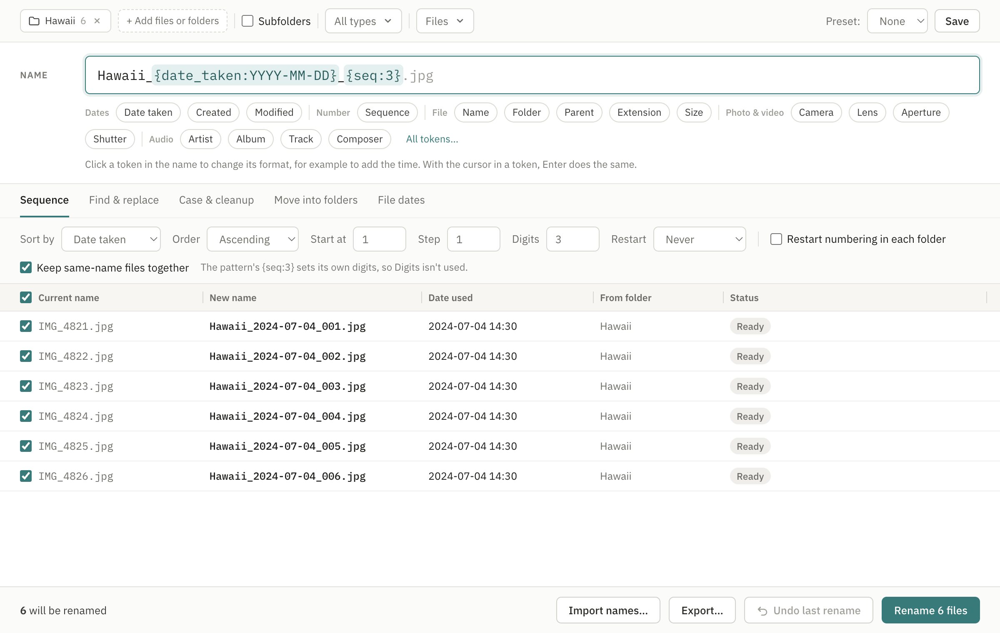

# Renami

[](https://github.com/AesonFord/Renami/actions/workflows/ci.yml?query=branch%3Amain)
[](https://github.com/AesonFord/Renami/releases/latest)
[](LICENSE)

A desktop app for renaming files in bulk. Drop in files and folders, write one name pattern such as `Hawaii_{date_taken:YYYY-MM-DD}_{seq:3}`, check the live preview, and rename. Renames can be undone until you quit.



Beyond patterns it can: number files in either direction with a step and a restart each day, month or year; edit names in the preview, drag rows into order, or import a list of names; find & replace on the current or the new name with regex backreferences; map extensions (`.jpeg` to `.jpg`); shift a wrong camera clock; use a date found in the file name; filter by name, size or date; rename the folders inside a folder; strip accents or force ASCII; and export the preview or a finished rename as CSV. Tokens include size, CRC32/MD5, aperture, shutter, frame rate, bitrate, composer and the parent folder.

It runs on macOS, Windows and Linux, and reads photo, video and audio metadata with a bundled copy of ExifTool.

**Download:** https://aesonford.github.io/Renami/, or pick a version on the [Releases](https://github.com/AesonFord/Renami/releases) page.

## Run it

You need Node 22 or later (CI uses Node 24).

```bash
npm ci
npm run dev      # the app, with live reload
npm start        # the app, built for production
```

If Electron starts as plain Node ("does not provide an export named 'BrowserWindow'"), your terminal has `ELECTRON_RUN_AS_NODE` set. Some editors set it. Run `unset ELECTRON_RUN_AS_NODE` first.

## Open with Renami

Drop a folder or files on the app icon (macOS), choose the app in "Open With", or right-click a folder in Explorer and pick "Rename with Renami" (Windows, added by the installer). From a terminal, `renami <paths…>` opens the app with those files once the [command line](#command-line) is installed. On Linux, the .deb also puts the app itself on PATH as `renami-app`. A second launch hands its paths to the window that is already open.

## Command line

`renami` renames files from a terminal, a script or CI, with the same engine as the app. It needs Node 22 or later:

```bash
npm install -g renami
```

It never changes anything without `--apply`:

```bash
renami rename ~/Photos/Hawaii -p 'Hawaii_{date_taken:YYYY-MM-DD}_{seq:3}'                            # preview
renami rename ~/Photos/Hawaii -p 'Hawaii_{date_taken:YYYY-MM-DD}_{seq:3}' --apply --journal undo.json  # rename
renami undo undo.json                                                                                # put it all back
```

`--journal` records the batch (it must be a new file), so `renami undo` can reverse it at any time, even after other runs. It skips files that changed since. `renami tokens` lists the tokens, and `renami --help` lists every option.

Settings the app can save, such as find & replace rules, extension maps and filters, can also be given as a JSON file. Flags override it:

```json
{
  "pattern": "{date_taken:YYYY-MM-DD}_{seq:3}",
  "sequence": { "sortBy": "dateTaken", "restartEvery": "day" },
  "findReplace": [{ "find": "^IMG_", "replace": "", "regex": true, "matchCase": false }],
  "cleanup": { "extensionRules": [{ "from": "jpeg", "to": "jpg" }] },
  "filter": { "includeSubfolders": true, "extensions": ["jpg", "heic"] }
}
```

Each find & replace rule needs all four fields (`find`, `replace`, `regex`, `matchCase`); a rule missing one is ignored, so check the dry run before adding `--apply`.

```bash
renami rename ~/Photos --settings trip.json --json   # the plan as one JSON object
```

A negative clock shift needs an `=`: `--shift=-60`.

| Exit code | Meaning |
|---|---|
| 0 | Done, or a dry run found no problems |
| 1 | Usage error: a bad option, a missing path, or an unreadable settings or journal file |
| 2 | Invalid pattern |
| 3 | Some files can't be renamed (nothing was renamed) |
| 4 | Files changed between the plan and the rename (nothing was renamed) |
| 5 | The rename or undo failed or was cancelled (anything moved was put back where possible), or the files were renamed but the journal couldn't be written |
| 6 | The undo skipped some files |
| 7 | `renami <paths…>`: the desktop app was not found |

`renami <paths…>`, with no command, opens the desktop app.

## Test it

```bash
npm test             # unit and integration tests (Vitest)
npm run typecheck    # both TypeScript configs
npm run e2e          # builds the app, then runs the Playwright tests
npm run build:cli    # the npm command line, into out/cli
```

## Package it

```bash
npm run pack   # an unpacked app in dist/, for a quick check
npm run dist   # installers for this OS: .dmg, NSIS .exe, or AppImage and .deb
```

To test the packaged app, run `npm run pack`, then `RENAMI_PACKAGED=1 npx playwright test packaged`.

The builds have no Developer ID or Authenticode signature:
- **macOS:** the app is ad-hoc signed but not notarized, so macOS blocks the first launch. Open System Settings, then Privacy & Security, and click "Open Anyway". On macOS 14 and earlier, right-click the app, then Open, is enough.
- **Windows:** SmartScreen shows "More info", then "Run anyway".

On Linux:
- On Ubuntu 24.04 and later, AppArmor's limit on unprivileged user namespaces can stop the AppImage from starting. Install the `.deb` instead, or allow the AppImage with an AppArmor profile.

## Release it

`main` only takes squash-merged PRs, so bump the version in a PR, then tag the merged commit:

```bash
git switch -c release-0.2.0
npm version 0.2.0 --no-git-tag-version     # bumps package.json and package-lock.json only
git commit -am "chore: release 0.2.0"
gh pr create --fill                        # squash-merge it once CI is green
git switch main && git pull
git tag v0.2.0 && git push origin v0.2.0   # tag the merged commit on main
```

The tag starts `.github/workflows/release.yml`. It checks the tag is on `main`, builds the installers on macOS, Windows and Linux from the hardened config (`electron-builder.release.yml`), checks each build's fuses, launches it, and publishes all five installers as one GitHub Release, with a `SHA256SUMS` file and a build provenance attestation. A version with a `-` (`0.2.0-beta.0`) is published as a prerelease.

If any platform fails, nothing is released. Release tags can't be deleted or moved, so fix it and release the next patch version the same way. Never tag the release branch: the squash merge gives `main` a different commit, and the tag would never be on `main`.

Each release also packs the command line (`renami-<version>.tgz`, attached to the release) and publishes it to npm with [trusted publishing](https://docs.npmjs.com/trusted-publishers), so the repository holds no npm token. One-time setup:

1. Publish the first version by hand: download `renami-<version>.tgz` from a release (or from a manual run's `cli-package` artifact), then run `npm publish renami-<version>.tgz --access public` while logged in to npm. Trusted publishing can only be set up on a package that exists. Check npm's docs in case this is no longer needed.
2. On npmjs.com, open the package's settings and add a trusted publisher: GitHub Actions, repository `AesonFord/Renami`, workflow `release.yml`.
3. Set the repository variable `NPM_PUBLISH` to `true` (Settings → Secrets and variables → Actions → Variables).

Until then, releases skip the npm publish and only attach the tarball. A tag with a `-` publishes under npm's `next` tag. If a release fails after its draft was created (for example at the npm publish), delete the draft release before re-running the workflow; if npm already has that version, make the draft public by hand with `gh release edit <tag> --draft=false` instead.

To check a downloaded installer:

```bash
gh attestation verify Renami-mac-arm64.dmg --repo AesonFord/Renami
shasum -a 256 -c SHA256SUMS --ignore-missing
```

To build and check the installers without releasing, run the workflow by hand (Actions → Release → Run workflow) and download the `installers-*` artifacts.

## The download site

The site is `site/`, plain HTML and CSS. `.github/workflows/pages.yml` deploys it when it changes on `main`, and `test/site/links.test.ts` fails if its download links and the release's installer names disagree. To retake its screenshot, run `npm run build`, then `RENAMI_SCREENSHOT=1 npx playwright test screenshot`.

## Where things are

| Path | What |
|---|---|
| `src/core` | The rename engine: plain TypeScript, no Electron or React |
| `src/main` | Electron main process: `Session` holds the state, `index.ts` wires IPC and dialogs |
| `src/preload` | The `window.api` bridge |
| `src/renderer` | The React UI |
| `src/shared/ipc.ts` | The IPC contract |
| `src/core/nameDate.ts` | Dates parsed from file names (used after the date taken) |
| `src/core/hash.ts` | CRC32 and MD5 for `{crc32}` and `{md5}`, read on demand |
| `src/renderer/components/tabs` | One file per option tab |
| `src/renderer/lib/csv.ts`, `importNames.ts` | CSV export and name-list import |
| `build/installer.nsh` | The Windows context-menu entry |

Presets are stored in `presets.json` in the app's user data folder:
- macOS: `~/Library/Application Support/Renami`
- Windows: `%APPDATA%\Renami`
- Linux: `~/.config/Renami`

A date found in a file name (for example `IMG_20240102_101112`) is used when a file has no date taken, before falling back to the created or modified date. Turn it off on the File dates tab.

## Contributing

See [CONTRIBUTING.md](CONTRIBUTING.md). To report a security problem, follow [SECURITY.md](SECURITY.md) instead of opening an issue.

## License

GPL-3.0-or-later. See `LICENSE`.
